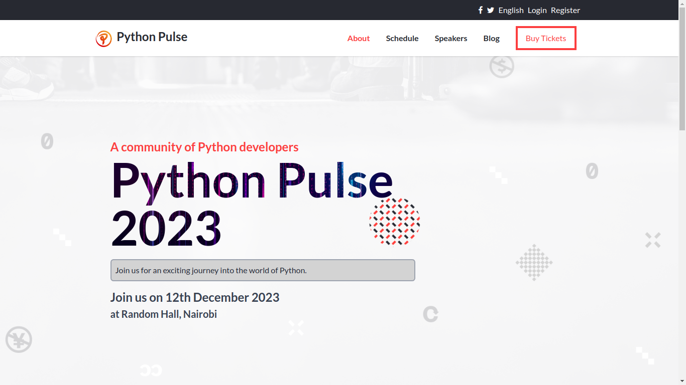

<a name="readme-top"></a>

<div align="center">
 
  <h2><b>Python Pulse</b></h2>

</div>
<!--
HOW TO USE:
This is an example of how you may give instructions on setting up your project locally.

Modify this file to match your project and remove sections that don't apply.

REQUIRED SECTIONS:
- Table of Contents
- About the Project
  - Built With
  - Live Demo
- Getting Started
- Authors
- Future Features
- Contributing
- Show your support
- Acknowledgements
- License

OPTIONAL SECTIONS:
- FAQ

After you're finished please remove all the comments and instructions!
-->


<!-- TABLE OF CONTENTS -->

# 📗 Table of Contents

- [📗 Table of Contents](#-table-of-contents)
- [📖Python Pulse](#python-pulse)
  - [🛠 Built With ](#-built-with-)
    - [Tech Stack ](#tech-stack-)
    - [Key Features ](#key-features-)
  - [💻 Getting Started ](#-getting-started-)
    - [Prerequisites](#prerequisites)
    - [Setup](#setup)
    - [Install](#install)
  - [👥 Authors ](#-authors-)
  - [🔭 Future Features ](#-future-features-)
  - [🤝 Contributing ](#-contributing-)
  - [⭐️ Show your support ](#️-show-your-support-)
  - [🙏 Acknowledgments ](#-acknowledgments-)
  - [📝 License ](#-license-)

<!-- PROJECT DESCRIPTION -->

# 📖Python Pulse<a name="about-project"></a>

** Python Pulse is web conference website for pythoneers. **

## 🛠 Built With <a name="built-with"></a>

### Tech Stack <a name="tech-stack"></a>


<details>
  <summary>Client</summary>
  <ul>
    <li>Html</li>
    <li>Tailwind Css </li>
    <li>Javascript </li>
  </ul>
</details>


<!-- Features -->

### Key Features <a name="key-features"></a>


- **[Navigation bar]**
- **[About section]**
- **[Contact Form]**
- **[Projects Popup]**
<!-- - **[key_feature_3]** -->

<p align="right">(<a href="#readme-top">back to top</a>)</p>

<!-- LIVE DEMO -->

<!-- ## 🚀 Live Demo <a href="kimitawanjohi.live" name="live-demo">kimitawanjohi.live</a> -->

<!--  -->

<!-- <p align="right">(<a href="#readme-top">back to top</a>)</p> -->

<!-- GETTING STARTED -->

## 💻 Getting Started <a name="getting-started"></a>


To get a local copy up and running, follow these steps.

### Prerequisites

In order to run this project you need: NodeJs 


### Setup

Clone this repository to your desired folder: 


```sh
  cd my-folder
  git clone https://github.com/kimitaWanjohi/python-pulse.git
```
### Install

Install this project with:


```sh
  cd python-pulse
  yarn install 
```

<p align="right">(<a href="#readme-top">back to top</a>)</p>

<!-- AUTHORS -->

## 👥 Authors <a name="authors"></a>

> Mention all of the collaborators of this project.

👤 **Author1**

- GitHub: [@githubhandle](https://github.com/kimitawanjohi)
- Twitter: [@twitterhandle](https://twitter.com/kimitaw)
- LinkedIn: [LinkedIn](https://linkedin.com/in/kimitawanjohi)


<p align="right">(<a href="#readme-top">back to top</a>)</p>

## 🔭 Future Features <a name="future-features"></a>

> Describe 1 - 3 features you will add to the project.

- [ ] **[mobile version]**
- [ ] **[Desktop version]**


<p align="right">(<a href="#readme-top">back to top</a>)</p>

## 🤝 Contributing <a name="contributing"></a>

Contributions, issues, and feature requests are welcome!

Feel free to check the [issues page](../../issues/).

<p align="right">(<a href="#readme-top">back to top</a>)</p>

## ⭐️ Show your support <a name="support"></a>


> Write a message to encourage readers to support your project

If you like this project feel free to leave comments and contact via given authors information above.

<p align="right">(<a href="#readme-top">back to top</a>)</p>

## 🙏 Acknowledgments <a name="acknowledgements"></a>

- [Microverse](https://www.microverse.org/)
- [kimita]('https://github.com/kimitawanjohi')

<p align="right">(<a href="#readme-top">back to top</a>)</p>

## 📝 License <a name="license"></a>


This project is [MIT](./LICENSE) licensed.

_NOTE: we recommend using the [MIT license](https://choosealicense.com/licenses/mit/) - you can set it up quickly by [using templates available on GitHub](https://docs.github.com/en/communities/setting-up-your-project-for-healthy-contributions/adding-a-license-to-a-repository). You can also use [any other license](https://choosealicense.com/licenses/) if you wish._

<p align="right">(<a href="#readme-top">back to top</a>)</p>